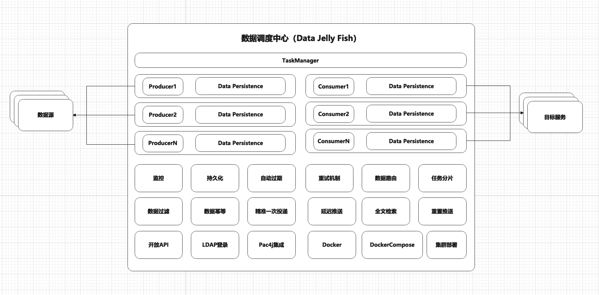
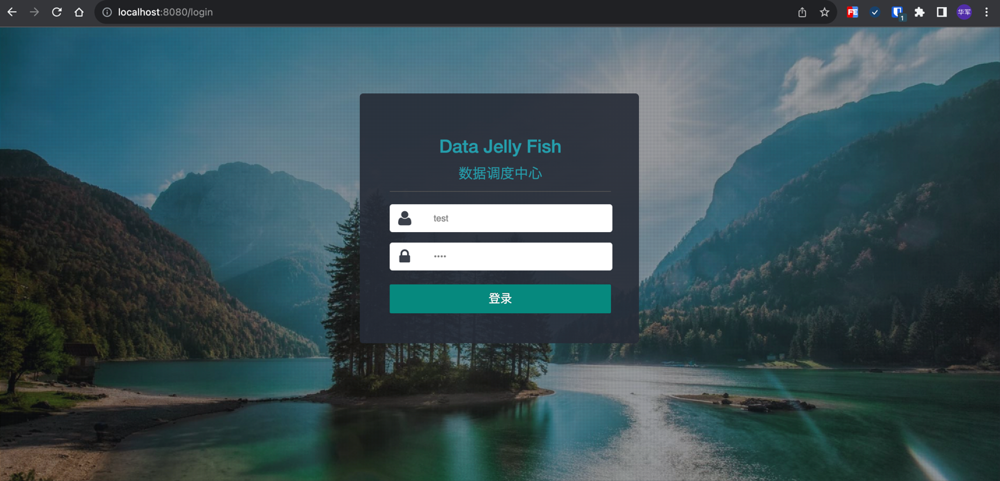
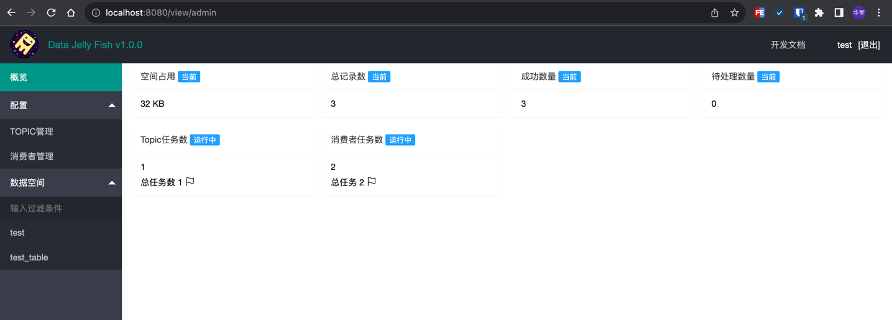
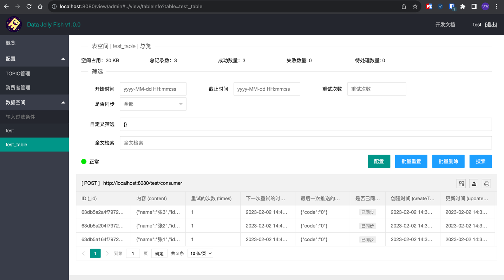

# 概述

在和三方系统对接的过程中，需要将内部系统的数据，推送给第三方，在这个过程中,可能需要将这个能力抽象成为一个公共的服务，这个服务应该需要具备:
1. 过程可视化，能够看到每一条数据输入输出的状态，能够看到各任务执行情况,健康状况。
2. 告警机制，通过对发生问题的数据来源方，目标方，及时感知，并通知业务线调整。支持企业微信、飞书、钉钉 等webhook
3. 良好的重启策略，按消费者设置重试次数，并支持固定间隔重试和指数级间隔重试两种方式
4. 历史数据自动清理，数据有效期设置，到期自动清理
5. 多消费者模式，一份数据源，能够推送给不同的目标服务，每个推送服务保存各自的数据推送状态
6. 消费数据过滤，一份数据源，根据过滤条件推送给不同的目标服务
7. 手动重置能力，在系统功能中，通过筛选部份数据，对该部分数据进行重置，实现触发重新推送
8. 开放API,使外部系统能够通过API与该系统进行交互，包括不限于添加数据源，添加消费者
9. 系统鉴权方式支持，支持PAC4J集成，内置LDAP,OIDC,匿名登录。其他登录方式自行集成
10. 基于Docker,Docker Compose 实现快速部署和使用
11. 无中心化设计，水平自动扩容

### 一、应用场景
1. 三方系统事件订阅和推送。内部系统之间数据订阅和推送

### 二、架构图

### 三、功能预览

默认为匿名登录：用户名和密码保持相同可进入系统。
另外系统基于Pac4j内置OIDC,LDAP两种登录方式，需要其他登录方式自行添加Pac4j依赖

